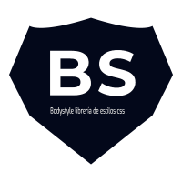

<p align="center"> 
    
</p>

# Bodystyle UI 

[](https://bodystyle.000webhostapp.com)
[]((https://github.com/FedericoManzano/bodystyle/blob/master/LICENSE)
[](https://github.com/FedericoManzano/show-code)
[](https://github.com/FedericoManzano/dynamics-tips)
[](https://github.com/FedericoManzano/bodystyle-iconos)
[](https://jquery.com/)
[](https://www.npmjs.com/package/body-ui)
[](https://github.com/FedericoManzano/bodystyle/blob/master/webpack.config.js)
[](https://github.com/webpack-contrib/css-loader)
[](https://github.com/webpack-contrib/style-loader)
[](https://www.npmjs.com/package/body-ui)

## Introducción

Bodystyle es una librería con licencia MIT [info](https://github.com/FedericoManzano/bodystyle/blob/master/LICENCE) para la creación del los elementos del front-end en sitios, páginas y/o aplicaciones web. Entre las diversas funcionalidades encontramos la generación de formularios, alertas, tips dinámicos, grilla, flexbox etc.


## Contenido
- [Estructura](https://github.com/FedericoManzano/bodystyle#estructura)
- [Documentación](https://github.com/FedericoManzano/bodystyle#documentaci%C3%B3n)
    - [contenido](https://github.com/FedericoManzano/bodystyle#contenido-documentaci%C3%B3n)
- [Comenzar](https://github.com/FedericoManzano/bodystyle#comenzar) 
    - [CDN](https://github.com/FedericoManzano/bodystyle#cdn)
        - [css](https://github.com/FedericoManzano/bodystyle#bodystylemincss)
        - [js](https://github.com/FedericoManzano/bodystyle#bodystyleminjs)
        - [adjuntos](https://github.com/FedericoManzano/bodystyle#repositorios-adjuntos)
- [plantilla](https://github.com/FedericoManzano/bodystyle#plantilla)
- [Descarga](https://github.com/FedericoManzano/bodystyle#descarga)
    - [pre-compilado](https://github.com/FedericoManzano/bodystyle#archivo-precompilado)
    - [repositorio]()
    - [npm](https://github.com/FedericoManzano/bodystyle#npm)
    - [npm git](https://github.com/FedericoManzano/bodystyle#npm)
    - [yarn](https://github.com/FedericoManzano/bodystyle#yarn)
- [Cambios](https://github.com/FedericoManzano/bodystyle#cambios-desde-la-versi%C3%B3n-2xx-a-3xx)
- [Licencia](https://github.com/FedericoManzano/bodystyle#licencia)
   
## Estructura

### Directorio Fuente

Código fuente de la librería Boodystyle.

```txt
bodystyle
    | dist
        | css
            | bodystyle.css
            | bodystyle.min.css
            | grillaSolo.css
            | grillaSolo.min.css
            |utilitarios.css
            |utilitarios.min.css
            |tema-claro.css
            |tema-claro.min.css
            |tema-oscuro.css
            |tema-oscuro.min.css
        | js
            | bodystyle.js
            | bodystyle.min.js
            | bodystyle.bundle.js
            | bodystyle.bundle.min.js
     | sass
        | globales
            | _variables.scss (Las variables globales de la librería)
        | tema-oscuro.scss
        | tema-claro.scss
        | utilitarios.scss
        | bodystyle.scss
     | js
        | src
            | modulos
                | (modulos).js
            | app.js
                
```

Para clonar la librería desde el repositorio de github:

```bash
git clone https://github.com/FedericoManzano/bodystyle
```

### Pre-compilado

Archivos pre-compilados no incluye código `sass` ni los módulos `js` por separado.

```txt
bodystyle
    | dist
        | css
            | bodystyle.css
            | bodystyle.min.css
            | grillaSolo.css
            | grillaSolo.min.css
            |utilitarios.css
            |utilitarios.min.css
            |tema-claro.css
            |tema-claro.min.css
            |tema-oscuro.css
            |tema-oscuro.min.css
        | js
            | bodystyle.js
            | bodystyle.min.js
            | bodystyle.bundle.js
            | bodystyle.bundle.min.js
    | LICENSE
    | README.md 
```

[bodystyle-v3.5.0-precompilado](https://www.dropbox.com/s/v6sgxtzw3w7ksrr/bodystyle-v3.5.0-precompilado.zip?dl=0)

## Documentación

Para conocer todas las funcionalidades de la librería acudir a su documentación en: 

[https://bodystyle.000webhostapp.com](https://bodystyle.000webhostapp.com)

### Contenido Documentación

- Inicio
    - [Home](https://bodystyle.000webhostapp.com/)
    - [Repositorio](https://github.com/FedericoManzano/bodystyle)
- Introducción
    - [GetStarted](https://bodystyle.000webhostapp.com/inicio/#/documentacion/GetStarted)
    - [Descarga](https://bodystyle.000webhostapp.com/inicio/#/documentacion/descarga)
    - [Tipgrafía](https://bodystyle.000webhostapp.com/inicio/#/documentacion/tipografia)
    - [Webpack](https://bodystyle.000webhostapp.com/inicio/#/documentacion/webpack)
- Alineamiento
    - [Contenedor](https://bodystyle.000webhostapp.com/inicio/#/documentacion/contenedor)
    - [Flexbox](https://bodystyle.000webhostapp.com/inicio/#/documentacion/flexbox)
    - [Grilla](https://bodystyle.000webhostapp.com/inicio/#/documentacion/grilla)
- CSS 
    - [Alertas](https://bodystyle.000webhostapp.com/inicio/#/documentacion/alertas)
    - [Ayudantes](https://bodystyle.000webhostapp.com/inicio/#/documentacion/ayudantes)
    - [breadcrumbs](https://bodystyle.000webhostapp.com/inicio/#/documentacion/breadcrumbs)
    - [badges](https://bodystyle.000webhostapp.com/inicio/#/documentacion/badges)
    - [colores](https://bodystyle.000webhostapp.com/inicio/#/documentacion/colores)
    - [decorarTitulos](https://bodystyle.000webhostapp.com/inicio/#/documentacion/decorarTitulos)
    - [efecto3d](https://bodystyle.000webhostapp.com/inicio/#/documentacion/efecto3d)
    - [efectoBorde](https://bodystyle.000webhostapp.com/inicio/#/documentacion/efectoBorde)
    - [fondos](https://bodystyle.000webhostapp.com/inicio/#/documentacion/fondos)
    - [formas](https://bodystyle.000webhostapp.com/inicio/#/documentacion/formas)
    - [iconos](https://bodystyle.000webhostapp.com/inicio/#/documentacion/iconos)
    - [imagenes](https://bodystyle.000webhostapp.com/inicio/#/documentacion/imagenes)
    - [links](https://bodystyle.000webhostapp.com/inicio/#/documentacion/links)
    - [redesSociales](https://bodystyle.000webhostapp.com/inicio/#/documentacion/redesSociales)
    - [tablas](https://bodystyle.000webhostapp.com/inicio/#/documentacion/tablas)
- JS
    - [BotonInicio](https://bodystyle.000webhostapp.com/inicio/#/documentacion/botonInicio)
    - [comentarioDinamico](https://bodystyle.000webhostapp.com/inicio/#/documentacion/comentarioDinamico)
    - [Dropdown](https://bodystyle.000webhostapp.com/inicio/#/documentacion/dropdown)
    - [Paralax](https://bodystyle.000webhostapp.com/inicio/#/documentacion/paralax)
    - [Personalizado](https://bodystyle.000webhostapp.com/inicio/#/documentacion/personalizado)
    - [Resaltar Sintaxis](https://bodystyle.000webhostapp.com/inicio/#/documentacion/resaltarSintaxis)
    - [Tabs](https://bodystyle.000webhostapp.com/inicio/#/documentacion/tabs)
    - [Toast](https://bodystyle.000webhostapp.com/inicio/#/documentacion/toast)
    - [Tooltips](https://bodystyle.000webhostapp.com/inicio/#/documentacion/tooltips)
    - [Waves](https://bodystyle.000webhostapp.com/inicio/#/documentacion/waves)
- Componentes
    - [Botones](https://bodystyle.000webhostapp.com/inicio/#/documentacion/botones)
    - [Colecciones](https://bodystyle.000webhostapp.com/inicio/#/documentacion/colecciones)
    - [ColeccionesFlotantes](https://bodystyle.000webhostapp.com/inicio/#/documentacion/coleccionesFlotantes)
    - [Grupos Botones](https://bodystyle.000webhostapp.com/inicio/#/documentacion/gruposBotones)
    - [Menu](https://bodystyle.000webhostapp.com/inicio/#/documentacion/menu)
    - [Modal](https://bodystyle.000webhostapp.com/inicio/#/documentacion/modal)
    - [Preloader](https://bodystyle.000webhostapp.com/inicio/#/documentacion/preloader)
    - [Progress Bar](https://bodystyle.000webhostapp.com/inicio/#/documentacion/progressBar)
    - [Sidebar](https://bodystyle.000webhostapp.com/inicio/#/documentacion/sidebar)
    - [Slider](https://bodystyle.000webhostapp.com/inicio/#/documentacion/slider)
    - [Tarjetas](https://bodystyle.000webhostapp.com/inicio/#/documentacion/tarjetas)
- Formularios
    - [checkbox](https://bodystyle.000webhostapp.com/inicio/#/documentacion/checkbox)
    - [file](https://bodystyle.000webhostapp.com/inicio/#/documentacion/file)
    - [formularios](https://bodystyle.000webhostapp.com/inicio/#/documentacion/formularios)
    - [gruposInput](https://bodystyle.000webhostapp.com/inicio/#/documentacion/gruposInput)
    - [inputText](https://bodystyle.000webhostapp.com/inicio/#/documentacion/inputText)
    - [radio](https://bodystyle.000webhostapp.com/inicio/#/documentacion/radio)
    - [range](https://bodystyle.000webhostapp.com/inicio/#/documentacion/range)
    - [select](https://bodystyle.000webhostapp.com/inicio/#/documentacion/select)
    - [switch](https://bodystyle.000webhostapp.com/inicio/#/documentacion/switch)
    - [templates](https://bodystyle.000webhostapp.com/inicio/#/documentacion/templates)
- Utilitarios
    - [Bordes](https://bodystyle.000webhostapp.com/inicio/#/documentacion/bordes)
    - [Margin](https://bodystyle.000webhostapp.com/inicio/#/documentacion/margin)
    - [Medidas](https://bodystyle.000webhostapp.com/inicio/#/documentacion/medidas)
    - [Overflow](https://bodystyle.000webhostapp.com/inicio/#/documentacion/overflow)
    - [Padding](https://bodystyle.000webhostapp.com/inicio/#/documentacion/padding)
    - [Sass](https://bodystyle.000webhostapp.com/inicio/#/documentacion/sass)
    - [Texto](https://bodystyle.000webhostapp.com/inicio/#/documentacion/texto)

## Comenzar 

La forma más rápida y sencilla de disponer de la librería es a través del CDN que enlaza con el código de los archivos minificados. 
La forma de utilizar estos enlaces es agregandolos dentro de la etiqueta `<head>...</head>` de nuestro documento html.

### CDN

#### bodystyle.min.css
```html
<link rel="stylesheet" href="https://rawcdn.githack.com/FedericoManzano/bodystyle/58a25e885718d0b2db6675c502ce6a41a45f373c/dist/css/bodystyle.min.css">
```

#### bodystyle.min.js
```html
<script src="https://code.jquery.com/jquery-3.5.1.min.js" integrity="sha256-9/aliU8dGd2tb6OSsuzixeV4y/faTqgFtohetphbbj0=" crossorigin="anonymous"></script>
<script src="https://rawcdn.githack.com/FedericoManzano/bodystyle/58a25e885718d0b2db6675c502ce6a41a45f373c/dist/js/bodystyle.min.js"></script>
```

### Repositorios adjuntos

A través de estos repositorios podemos acceder a la grilla y a los utilitarios de la librería unicamente.

[](https://github.com/FedericoManzano/bodystyle-grid)
[](https://github.com/FedericoManzano/bodystyle-utility)

### Plantilla

Dejamos una plantilla para copiar y pegar para poder cargar la librería con lo que mencionamos antes.

```html
<!DOCTYPE html>
<html>
    <head>
        <!-- META obligatorio para poder utilizar la libreria -->
        <meta name="viewport" content="width=device-width, initial-scale=1.0">

        <!-- Link con el CDN de los estilos css  -->
        <link rel="stylesheet" href="https://rawcdn.githack.com/FedericoManzano/bodystyle/58a25e885718d0b2db6675c502ce6a41a45f373c/dist/css/bodystyle.min.css">
    </head>
    <body>
        <h1>Hola Mundo !!! <span class="badge badge-rojo">New</h1>
        <script src="https://rawcdn.githack.com/FedericoManzano/bodystyle/58a25e885718d0b2db6675c502ce6a41a45f373c/dist/js/bodystyle.min.js"></script>
    </body>
</html>
```


## Descarga 

Podemos disponer de la librería a través de su código fuente, el archivo pre-compilado o instalarla como una dependencia de nuestro proyecto con los gestores de paquetes 
de Node.

### Archivo Precompilado

[bodystyle-v3.5.0-precompilado](https://www.dropbox.com/s/v6sgxtzw3w7ksrr/bodystyle-v3.5.0-precompilado.zip?dl=0)


### Archivo Fuente

[bodystyle-master.zip](https://github.com/FedericoManzano/bodystyle/archive/master.zip)

### Node package
Ingresar por el terminal los siguientes comandos para instalar la dependencia de la librería.

#### NPM 
```
$ npm i body-ui
```

#### Yarn 
```
$ yarn add body-ui
```

#### NPM Git 
```
$ npm install @federicomanzano/bodystyle@3.5.6
```


## Cambios desde la versión 2.x.x a 3.x.x

- Capacidad deresaltar el código fuente de `html`, `js`, `css`, `java`, `c`.
- Dependencia dynamics-tips para los tooltips, comentarios y dropdown.
- Mejoramiento de las barras de navegación.
- Dropdown refactorizado y depurado respecto versiones anteriores.
- Archivo bodystyle.bundle.js con todos los archivos de estilo y módulos de js en un sólo archivo.
- Se incorporan íconos de fuente para añadirle a los elementos.
 > Se eliminaron las funcionalidades de resaltar el código fuente y se los reemplazó con una dependecia show-code-v1.1.1. 

[show-code](https://github.com/FedericoManzano/show-code)
[dynamics-tips](https://github.com/FedericoManzano/dynamics-tips)

## Licencia

MIT 

bodystyle (c) 2020
